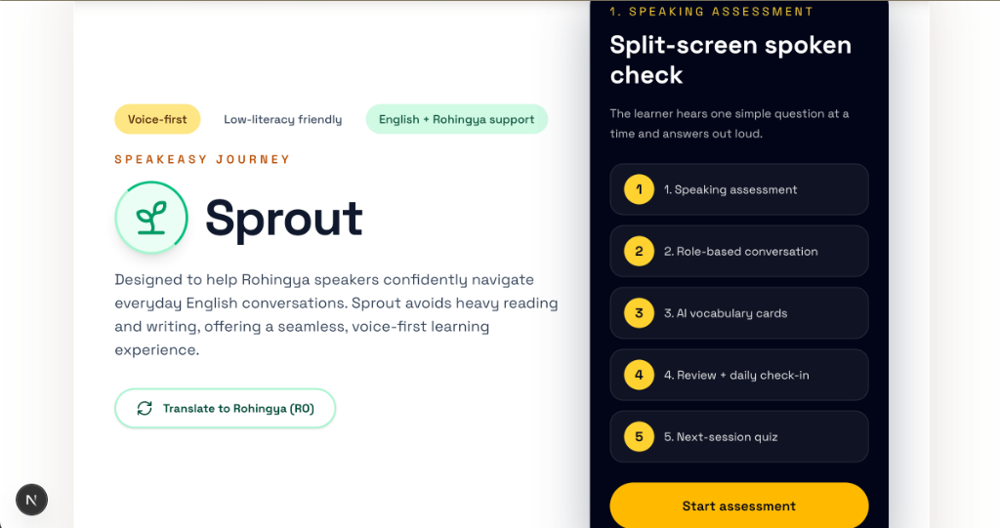
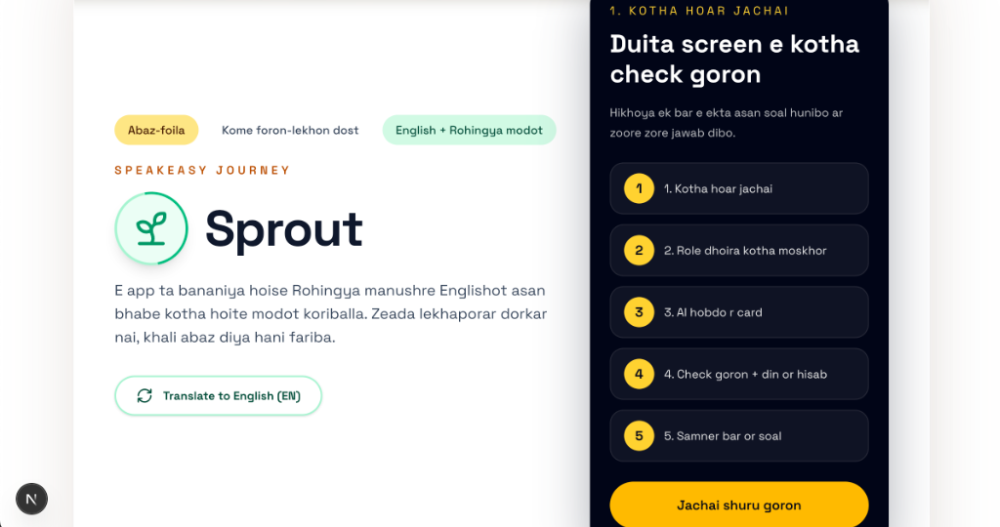
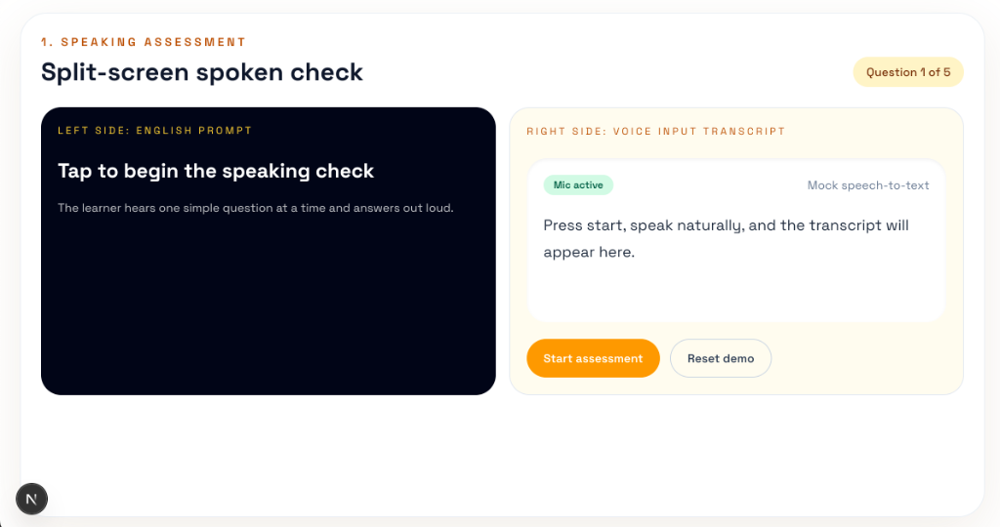
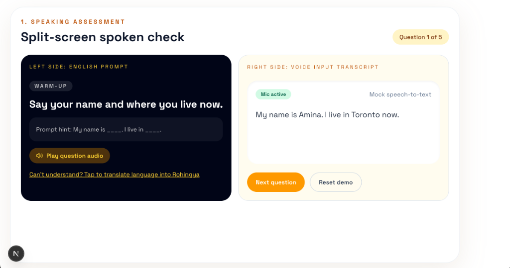

# SpeakEasy (Sprout): Voice-First English Learning MVP

[**👉 Experience the live interactive MVP here on GitHub Pages 👈**](https://maggiemajiayi-cell.github.io/Sprout_voice_input_AItraining/)

Team formation: JiaYi Ma, Tianze Yin, Yuyang Mei, Medha Narumanchi

SpeakEasy is a prototype English coaching application built for a hackathon. It focuses entirely on a **voice-first** user experience tailormade for newcomers and refugees with low literacy. This application avoids heavy reading and writing dependencies, relying instead on spoken AI interactions, simulated environments, and clear visual cues.

## Key Features

- **Split-Screen Speaking Assessment:** Easily gauge the learner's incoming level with simple, voice-based prompt questions.
- **Scenario-Based Conversation Practice:** The AI adapts its tone and speaking style based on real-world personas (e.g., Friend, Manager, Professor, Customer) while interacting dynamically with the learner's input.
- **AI-Generated Vocabulary:** Fresh vocabulary words are dynamically generated and surfaced depending on how the conversation flowed. 
- **Voice Output Built for ElevenLabs:** The interface is built anticipating integration with speech-to-text engines and modern Text-to-Speech voices like ElevenLabs to simulate immersive audio feedback.
- **Goal Tracking & Gamification:** Daily streaks, check-in calendars, and vocabulary quizzes encourage habit formation based on Duolingo's successful gamification loop.
- **Full Bilingual Support (English & Rohingya):** A seamless language toggle makes the entire UI instantly comprehensible for native Rohingya speakers. 

## Screenshots

### Main Landing Page (English)


### Main Landing Page (Rohingya Translation)


### Speaking Assessment Start


### Speaking Assessment Active


## Tech Stack
- **Framework:** Next.js (App Router) & React
- **Language:** TypeScript
- **Styling:** Tailwind CSS 
- **Icons:** Lucide React

## Current App Flow

The current MVP uses a simple three-step screen flow:

1. **Landing screen**
2. **Assessment screen**
3. **Post-assessment dashboard**

The app starts on a full-screen landing page with the title, short description, language toggle, and a single entry button into the assessment flow.

After the learner starts, the app moves to the speaking assessment screen. This screen walks through the mock assessment questions and shows a split layout with the prompt on one side and the simulated voice transcript on the other.

When the assessment is finished, the app transitions into the main dashboard. The dashboard contains the rest of the product demo features, including role-based conversation practice, vocabulary review, daily check-ins, quizzes, goal tracking, and the mock ElevenLabs voice area.

## File Structure And Responsibilities

### App entry and global setup

- `app/page.tsx`
  Main screen controller for the app. It manages the top-level state for:
  - current screen (`landing`, `assessment`, `dashboard`)
  - current language
  - assessment progress
  - selected conversation role
  - typed practice input
  - quiz state

- `app/layout.tsx`
  Global app shell, metadata, and font setup.

- `app/globals.css`
  Global styles shared by the whole app.

### Main screens

- `components/home/landing-screen.tsx`
  Full-screen landing page with the title, intro copy, language toggle, and assessment entry button.

- `components/home/assessment-section.tsx`
  Speaking assessment UI. It displays the current question, mock transcript, and the controls to move forward or reset the demo.

- `components/home/dashboard-screen.tsx`
  Post-assessment dashboard. It contains the dashboard layout and tab switching for the main learning features.

### Dashboard feature sections

- `components/home/scenario-practice-section.tsx`
  Role-based conversation practice for friend, professor, manager, and customer scenarios.

- `components/home/vocabulary-section.tsx`
  Displays the generated vocabulary cards related to the current conversation role.

- `components/home/voice-output-section.tsx`
  Demo placeholder for spoken AI output and future ElevenLabs integration.

- `components/home/daily-checkin-section.tsx`
  Daily check-in calendar and review vocabulary display.

- `components/home/quiz-section.tsx`
  Next-session vocabulary quiz area.

- `components/home/goal-tracking-section.tsx`
  Goal, streak, and progress display section.

- `components/ui/metric-card.tsx`
  Reusable small metric card used across the UI.

### Data layer

- `data/translations.ts`
  Contains the English and Rohingya content used by the app, including:
  - UI labels
  - assessment questions
  - scenario text
  - quiz content
  - vocabulary meanings

- `data/daily-checks.ts`
  Mock daily check-in calendar data.

- `data/role-options.ts`
  Available role options for the scenario practice module.

- `data/word-maps.ts`
  Focused vocabulary map used by the conversation vocabulary logic.

### Logic layer

- `lib/conversation.ts`
  Contains the helper logic that derives which vocabulary words should appear based on the selected role.

### Shared types

- `types/app.ts`
  Shared TypeScript types for the app, including language, role, assessment, quiz, translation, and vocabulary-related types.

## Architecture Notes

The project is intentionally structured so that:

- `app/page.tsx` acts as the top-level flow controller
- UI components stay focused on presentation and user interaction
- mock content is stored in the `data/` folder
- derivation logic is kept in `lib/`
- shared type definitions live in `types/`

This keeps the hackathon MVP simple while making it easier to extend later with real APIs, real speech input/output, persistent user progress, and route-based screens.

## Running Locally

Clone the repository and install dependencies:

```bash
git clone https://github.com/maggiemajiayi-cell/AI-data-hackathon.git
cd AI-data-hackathon
npm install
```

Start the development server:
```bash
npm run dev
```
Navigate to `http://localhost:3000` to view the MVP in action!

## Future Hackathon Priorities
1. **API Integration**: Swap mockup hooks with live backend inference calls.
2. **Text-To-Speech (TTS):** Integrate ElevenLabs standard voices for AI character outputs.
3. **Speech-To-Text (STT):** Plug in a browser MediaRecorder or a Whisper endpoint to ingest microphone answers automatically. 
4. **Backend State:** Implement user authentication and persistent progress saving.
